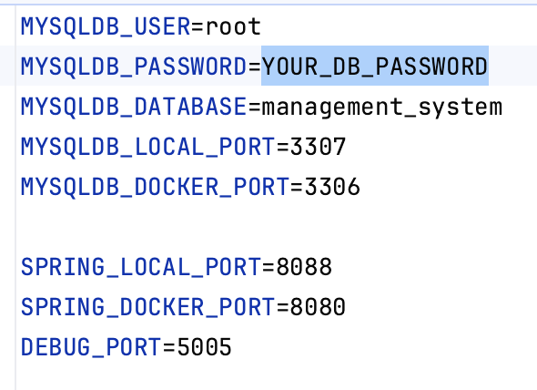

# Air Companies Management System

<hr>

## Short description

It is an application that was created to help airlines manage their flights. This program allows you to add planes, 
air companies, and flights to the database, change air company for the plane, change flight status, and display 
information about planes, air companies, and flights.

<hr>

## Technologies and tools used

* Java 11 (SOLID, Stream Api, Collections)
* Spring (Boot, Data JPA, Web MVC)
* Documentation: Swagger
* Version Control: Git
* Maven
* Docker

<hr>

## How you can start up the application

The project is a server part, and is able to receive requests from clients (browsers), process them,
and return the response. Postman will also be very useful for testing the application, and see how it works. So you need:

* [download](https://github.com/dima-semeniuk/air_companies_management_system/blob/main/postman/AirCompaniesManagementSystem.postman_collection.json) 
the Postman collection from my GitHub repository and import it into your desktop Postman or web Postman Api Platform
* You can fork project to your GitHub repository or copy URL from my repo and make clone of the project locally to your machine.
Then open project in IntelliJ Idea
* The project uses a Docker and after download the application from GitHub, before running project don't forget install, 
and run Docker on your machine 💻
* Also, you will need to set up the file `.env` at the root of the project. Change the password to your value 
(also you can change other properties), like in the picture below:



* Run in console command `docker-compose build` to build Docker images defined in a docker-compose.yml file. 
After building images, run the command `docker-compose up` to start application
* Then go to Postman and use the functionalities of controllers:

#### AirCompany controller

>  POST method: /localhost:8088/api/air-companies

This endpoint is for adding a new air company to the database.Example of request body:

```json
{
  "name": "Air France–KLM",
  "companyType": "CORPORATION",
  "foundedAt": 2012
}
```

<br>

>  >  PUT method: /localhost:8088/api/air-companies/{id}

This endpoint is for updating information about air company by its 'id'.Example of request body:

```json
{
  "name": "Air Company",
  "companyType": "LLC",
  "foundedAt": 2020
}
```
<br>

>  GET method: /localhost:8088/api/air-companies/{id}

This endpoint shows information about air company by its 'id'

<br>

>  GET method: /localhost:8088/api/air-companies

This endpoint shows information about all air companies

<br>

>  DELETE method: /api/air-companies/{id}

This endpoint is for deleting air company from database by its 'id'

<br>

#### Airplane controller

>  GET method: /localhost:8088/api/airplanes

This endpoint shows information about all airplanes

<br>

>  >  PATCH method: /localhost:8088/api/airplanes/{id}

This endpoint is for changing air company for airplane by its 'id'.Example of request body:

```json
{
  "airCompanyId": 4
}
```

<br>

>  POST method: /localhost:8088/api/airplanes

This endpoint is for adding a new airplanes to the database.Example of request body:

```json
{
  "name": "Airplane7",
  "factorySerialNumber":"123DJGG1276",
  "airCompanyId": 4,
  "numberOfFlights": 34,
  "flightDistance":45230,
  "fuelCapacity": 10140,
  "airplaneType":"AIRSHIP",
  "createdAt": "2017-05-10"
}
```

<br>

#### Flight controller

>  POST method: /localhost:8088/api/flights

This endpoint is for adding a new flights to the database.Example of request body:

```json
{
  "airCompanyId": 3,
  "airplaneId": 2,
  "departureCountry": "Ukraine",
  "destinationCountry": "Portugale",
  "distance": 3350,
  "estimatedFlightTime": "04:25"
}
```

<br>

>  >  PATCH method: /localhost:8088/api/flights/{id}

This endpoint is for changing flight status for flight by its 'id'.Example of request body:

```json
{
  "flightStatus": "ACTIVE"
}
```

<br>

>  GET method: /localhost:8088/api/flights/by-company-name-and-status

This endpoint shows information about all flights by air company name and flight status.
Air company name we can set ignore the case, and it will be receptive to all matches in the name.
`Status` and `air-company-name` we set like request param in URL
 
<br>

>  GET method: /localhost:8088/api/flights/active-over-limit

This endpoint shows information about all `ACTIVE` flights, which last longer than 24 hours

<br>

<br>

>  GET method: /localhost:8088/api/flights/completed-overdue

This endpoint shows information about all `COMPLETED` flights, that were longer than the estimated flight time

<br>

* Also, you can test the application, and see how it works, using Swagger API documentation. After running 
application in docker follow the link http://localhost:8088/api/swagger-ui/index.html

Then enjoy testing the application.

<hr>


